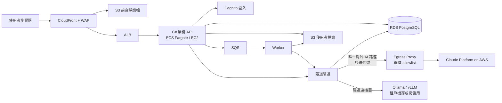

多租戶 AI 應用平台 · 架構說明 v2

# 隱道 Veilway

**Veilway 是整套前後台系統的總稱**：前台、業務 API、資料庫、檔案與非同步處理，以及其中的核心元件「隱道閘道」。

整套系統跟一般 SaaS 最大的不同在於：所有 AI 請求都走同一條道。送出前，平台先把個資換成代號；回覆回來後，再換回真名。外部模型從頭到尾只看得到代號，而代號和真名的對照表從不離開平台。

> 本版整合了 v1 架構圖（依據「AI-前後台架構 總結」，2026-10-06）與後續討論：出口管控、模型接入方式、對照表範圍、檢查點處理規則、三階段建置順序。

---

## 1. 全景：系統元件

| 層 | 元件 | 說明 |
| --- | --- | --- |
| 邊緣 | CloudFront + WAF | 前台快取、TLS、基本防護 |
| 前台 | S3 靜態網站 | 只透過 CloudFront 存取（OAC），bucket 不公開 |
| 分流 | ALB | 把 `/api/*` 轉到後端。MVP 階段可以先拿掉 ALB，後端改跑單台 EC2 |
| 業務 API | C# controller | 跑在 ECS Fargate 或 EC2 的私有子網 |
| 身分 | Cognito | 簽發 JWT；token 內帶 `tenant_id`。登入狀態不需要另外存 session |
| 資料 | RDS PostgreSQL | 租戶、使用者、對話歷史、對照表、稽核紀錄、計量。每張表都帶 `tenant_id`，搭配 Row-Level Security |
| 檔案 | S3（私有） | 使用者上傳的原始檔，以 SSE-KMS 加密 |
| 非同步 | SQS + Worker | 文件解析、OCR、大檔遮蔽、批次任務 |
| AI 出口 | 隱道閘道 | 後端內**唯一**能連到平台外模型的元件 |
| 橫向服務 | Secrets Manager、KMS、CloudWatch | 金鑰、加密、監控 |

全部元件都在台北區域內。**只有隱道閘道送出、經過遮蔽的內容會跨出平台。**

---

## 2. 一次 AI 請求怎麼走過隱道

1. 使用者輸入：「請幫王小明安排下週到台北分公司拜訪」
2. **遮蔽器**：換成「請幫 `[PERSON_1]` 安排下週到 `[LOCATION_1]` 拜訪」，同時把對應關係寫進對照表
3. **檢查點**：送出前再掃一次（規則見第 5 節）
4. 送往外部模型：模型只看得到代號
5. 模型回覆：「已為 `[PERSON_1]` 安排…」
6. **還原器**：讀取對照表，換回「已為王小明安排…」
7. 回傳給使用者；送出的遮蔽後內容寫進 `AI_REQUEST_LOG`

---

## 3. 隱道閘道的元件

| 位置 | 中文名 | 英文名 | 做法 |
| --- | --- | --- | --- |
| 後端內的 AI Gateway | 隱道閘道 | Veilway Gateway | 統一介面 `IChatClient`（Microsoft.Extensions.AI）。遮蔽、檢查、還原、計量各寫成一層 `DelegatingChatClient`，串成管線；換模型供應商時這幾層不必修改 |
| 去程第一步 | 遮蔽器 | Veil Masker | 三層：① 正規表示式（身分證、手機、市話、Email、卡號、統編）② 租戶字典（客戶名單、員工名冊）③ CPU 可跑的繁中 NER（人名、地址、公司名）。另外做別名展開：王小明 → 小明、王先生、王董 |
| 平台資料庫 | 對照表 | Veil Map | 真名與代號的對應。存在 RDS，用租戶的 KMS key 加密，範圍規則見第 4 節 |
| 跨越邊界前 | 檢查點 | Veil Check | 送出前的最後一關，規則見第 5 節 |
| 回程 | 還原器 | Unveiler | 把回覆中的代號換回真名。要能容錯（例如模型寫成 `PERSON_1's`），串流時要有緩衝區 |
| 通往租戶機房 | 隱道連接器 | Veilway Connector | 接 Ollama／vLLM 等 OpenAI 相容端點，切換只需改 endpoint |

---

## 4. 對照表（Veil Map）的範圍

| | 每個對話（**預設**） | 每個租戶（**限特定功能**） |
| --- | --- | --- |
| 同一個人在不同對話中的代號 | 每個對話各自編號 | 長期都是同一個代號 |
| 外部能看到的 | 只能看到單次對話，無法跨對話串起來 | 能累積長期的行為側寫，側寫本身就可能認出是誰 |
| 資料量與風險 | 小，對話結束加上 TTL 就刪 | 一直成長，外洩時影響最大 |
| 刪除權 | 對話刪了，對照也跟著沒了 | 要另外清理 |
| 適用場景 | 一般聊天、單次文件處理 | RAG 索引、長期記憶 |

規則：

- 預設用「每個對話」。
- 租戶範圍的對照表放在獨立的表，另外加密、另外設權限。
- **任何情況下都不跨租戶共用。**

---

## 5. 檢查點（Veil Check）

### 5.1 它檢查什麼

送出前，掃描「準備送出的最終文字」：

1. **對照表裡的原值又出現了**：例如「王小明」已經登記在對照表，送出的內容卻還有「王小明」。通常是遮蔽器的 bug，或同一個名字有不同寫法，只換到其中一種。
2. **正規表示式重掃**：檢查格式固定的個資有沒有漏網。
3. **租戶字典比對**：客戶名單、員工名冊裡的名字有沒有出現。

> **限制**：NER 第一次就沒認出來的東西，檢查點多半也認不出來。檢查點防的是程式出錯，不是第二層 NER，對內對外都要講清楚，不要讓人以為有兩道防線。

### 5.2 被攔下時怎麼處理

| 情況 | 處理 |
| --- | --- |
| 對照表裡的原值沒換掉 | 自動補遮後重送，使用者不會感覺到 |
| 正規表示式或字典高信心命中（身分證、卡號） | 自動補遮；補遮後仍命中就 **fail-closed**，拒絕送出 |
| 低信心命中（像人名但不確定，例如「林立」） | 依租戶政策：嚴格的租戶直接拒絕；一般租戶讓使用者勾選「這不是個資」後送出，並記下這次放行 |
| 檢查點本身故障或逾時 | **一律 fail-closed** |

每次攔截都寫入稽核紀錄（攔了什麼類型、怎麼處理），**但不記錄命中的原文**。

---

## 6. 出口管控：「唯一出口」用網路設定強制做到

- 後端放在私有子網，不給一般的對外網路。
- 閘道連到 **Claude Platform on AWS** 的流量，經過 egress proxy（或 AWS Network Firewall）加網域 allowlist，只放行 `aws-external-anthropic.{region}.api.aws`。其他服務的 security group 不放行這條路徑。
- **雙重鎖定**：Claude Platform on AWS 用 IAM／SigV4 驗證，呼叫權限只授權給閘道的 IAM role。其他服務就算網路連得到、也裝了 SDK，沒有權限也呼叫不了。
- **待確認**：Claude Platform on AWS 是否支援 VPC endpoint（PrivateLink）。如果支援，就改走 VPC endpoint，後端子網連 NAT 都不需要。
- 需要其他對外連線時（例如寄信），同樣走 egress proxy 加網域 allowlist。
- **日誌也是外洩路徑**：應用程式日誌和例外訊息不能印出原始 prompt，CloudWatch 要定期抽查。

---

## 7. 模型接入方式

| | Claude Platform on AWS（**採用**） | Amazon Bedrock | 直連 Anthropic API |
| --- | --- | --- | --- |
| 營運方 | Anthropic（走 AWS 的帳號和計費） | AWS | Anthropic |
| 驗證 | IAM／SigV4 | IAM／SigV4 | API key |
| 計費 | AWS Marketplace | AWS 帳單 | Anthropic 帳單 |
| 功能 | 和第一方 API 同步，含 Batch、Files API、`inference_geo` | 是子集，新功能較晚到；沒有 Batch、Files API 等 | 完整 |
| 網路 | AWS 端點 `aws-external-anthropic.{region}.api.aws`；出口靠 egress allowlist 加 IAM 鎖定 | VPC endpoint | 經過公網，需要 NAT 和 allowlist |
| 模型 ID | 第一方 ID，不加前綴 | 需加 `anthropic.` 前綴 | 第一方 ID |

**採用理由**：

- 新模型和新功能同步推出。
- 有 Batch（非即時工作半價）和 Files API，第三階段的文件處理可以直接用上。
- 仍然是 IAM 驗證、AWS 計費，和其他 AWS 服務一起管理。

**設定重點**：

- 建立 client 時必須提供 `AWS_REGION` 和 workspace ID（`ANTHROPIC_AWS_WORKSPACE_ID`），兩者都沒有預設值。
- C# 使用 `Anthropic.Aws` 套件的 `AnthropicAwsClient`。
- 閘道的 `IChatClient` 抽象讓三種方式可以互換，日後要改走 Bedrock，業務程式碼也不必修改。

**待確認**：

- Claude Platform on AWS 可用的區域；如果台北區域沒有，要看能接上的最近區域。
- `inference_geo` 能指定哪些地理區。這關係到「推論在哪裡執行」的說法，要以官方文件的現況為準。

不論答案是什麼，跨出平台的都只有代號。
- **Ollama 的定位**：在 AWS 上跑 Ollama 需要 GPU 機型，成本不低。平台內的 Ollama 只當開發和測試用的替身，以及驗證隱道連接器；正式環境的地端模型由租戶在自己的機房提供。
- **路由政策**：模型就在租戶機房時，可以依租戶政策不做遮蔽，換取較好的回答品質。是否遮蔽由「資料分級 × 目的地」決定。

---

## 8. 對回答品質的影響與對策

- **代號格式**：用 `[PERSON_1]`，在 system prompt 要求模型原樣保留代號。視需要讓代號帶屬性，例如 `[PERSON_1:男:客戶]`，讓模型用對稱謂，但這會多洩漏一點資訊，屬於取捨。
- **需要計算的資料**：日期用相對位移、年齡用區間，避免遮蔽後模型算不出來。
- **Tool calling**：模型呼叫工具時，參數先還原成真值才在平台內執行；工具回傳的結果重新遮蔽後才送回模型。
- **RAG**：文件入庫前先遮蔽，並使用租戶範圍的對照表。
- **檔案**：上傳的原檔留在 S3；送給模型的是遮蔽後抽出的文字。影像先 OCR 再走文字流程，錄音先轉成文字再走文字流程。

---

## 9. 法規定位

代號化在個資法和 GDPR 的框架下都屬於**假名化**，資料仍然算個人資料。對外不宣稱「匿名化」或「完全無法識別」，因為上下文可能還帶著間接識別資訊（例如罕見職稱加地點加日期的組合）。

---

## 10. 遮蔽品質的驗證：測試集

- **資料**：合成的台灣格式個資（身分證要符合檢查碼、各種寫法的電話、各種格式的地址），套進真實語境的句子模板。**不使用真實客戶資料。**
- **困難案例**：兩字人名、和一般詞重疊的人名、稱謂、全形數字、中英混寫、拆成好幾段的地址。
- **指標**：依個資類型分別計算召回率（漏遮比多遮嚴重），另外量測遮蔽前後回答品質的差距。
- **用法**：每次調整遮蔽規則或更換 NER 模型都跑一次，當作回歸測試；也作為對租戶說明保護程度的依據。

---

## 11. 待決事項

- [ ] Claude Platform on AWS 可用的區域、`inference_geo` 的選項，以及是否支援 VPC endpoint
- [ ] 檢查點遇到低信心命中時，各租戶的預設政策
- [ ] 代號是否帶屬性（性別、角色）
- [ ] 間接識別資訊的遮蔽規則
- [ ] 影像與錄音遮蔽的詳細設計

建置順序見〈Veilway三階段執行計畫.md〉。
