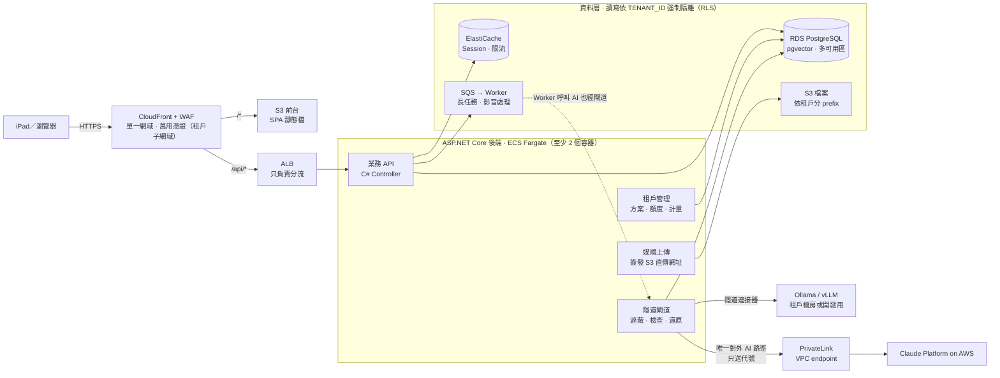

多租戶 AI 應用平台 · 架構說明 v2

# 隱道 Veilway

**Veilway 是整套前後台系統的總稱**：前台、業務 API、資料庫、檔案與非同步處理，以及其中的核心元件「隱道閘道」。

整套系統跟一般 SaaS 最大的不同在於：所有 AI 請求都走同一條道。送出前，平台先把個資換成代號；回覆回來後，再換回真名。外部模型從頭到尾只看得到代號，而代號和真名的對照表從不離開平台。

**定位：Veilway 是產品底座。**Veilway 本身不承載特定業務，而是一套可重複使用的多租戶 AI 應用底座（共用套件 + IaC 範本）。之後的各個產品，例如保險業務員 AI 平台、中原大學產學脈動平台，各自從 Veilway 獨立出去：自己的程式碼、後台、資料庫、入口網址與 AWS 環境，但共用同一套隱道與多租戶機制。詳見第 11 節。

> 本版整合了 v1 架構圖（依據「AI-前後台架構 總結」，2026-10-06）與後續討論：出口管控、模型接入方式、對照表範圍、檢查點處理規則、三階段建置順序。系統元件以原架構圖為準（含 ElastiCache、pgvector、租戶子網域等）。

---

## 1. 全景：系統元件

> 排版較精確的版本見〈Veilway架構圖v2.pdf〉。



| 層 | 元件 | 說明 |
| --- | --- | --- |
| 邊緣 | CloudFront + WAF | 單一網域、萬用憑證，每個租戶一個子網域（例如 `acme.example.com`）；前台快取、TLS、基本防護。`/*` 到 S3 前台，`/api/*` 到 ALB |
| 前台 | S3 靜態網站（SPA） | 只透過 CloudFront 存取（OAC），bucket 不公開 |
| 分流 | ALB | 只負責分流到後端容器。MVP 階段可以先拿掉 ALB，後端改跑單台 EC2 |
| 後端 | ASP.NET Core · ECS Fargate | 正式環境**至少 2 個容器**（跨可用區），跑在私有子網。內含四個模組：業務 API（C# Controller）、租戶管理、媒體上傳、隱道閘道 |
| 租戶管理 | 後端模組 | 租戶的方案、額度、計量；AI token 用量與檔案用量都記在這裡 |
| 媒體上傳 | 後端模組 | 簽發 S3 直傳網址（presigned URL），檔案不經過後端 |
| 身分 | Cognito | 簽發 JWT，token 內帶 `tenant_id`。API 要核對子網域對應的租戶和 token 裡的 `tenant_id` 一致 |
| 資料 | RDS PostgreSQL（多可用區） | 租戶、使用者、對話歷史、對照表、稽核紀錄、計量。每張表都帶 `tenant_id`，搭配 Row-Level Security。啟用 **pgvector** 擴充，給 RAG 存向量 |
| 快取 | ElastiCache | **Session**（登入狀態、登出後讓 token 失效）與**限流**（每個租戶、每個使用者的請求頻率和 AI 額度）。要開啟傳輸中與靜態加密；**不放對照表或任何真名** |
| 檔案 | S3（私有） | 使用者上傳的原始檔，**依租戶分 prefix**（`tenants/{tenant_id}/…`），以 SSE-KMS 加密；IAM 與 presigned URL 都限制在該租戶的 prefix |
| 非同步 | SQS + Worker | 長任務與影音處理：文件解析、OCR、錄音轉文字、大檔遮蔽、批次任務 |
| AI 出口 | 隱道閘道 | 後端內**唯一**能連到平台外模型的元件 |
| 橫向服務 | Secrets Manager、KMS、CloudWatch | 金鑰、加密、監控 |

**平台元件**全部在台北區域內。模型推論在 Anthropic 的資料中心（美國或全球，見第 7 節），**跨出平台的只有隱道閘道送出、經過遮蔽的內容**。

---

## 2. 一次 AI 請求怎麼走過隱道

1. 使用者輸入：「請幫王小明安排下週到台北分公司拜訪」
2. **遮蔽器**：換成「請幫 `[PERSON_1]` 安排下週到 `[LOCATION_1]` 拜訪」，同時把對應關係寫進對照表
3. **檢查點**：送出前再掃一次（規則見第 5 節）
4. 送往外部模型：模型只看得到代號
5. 模型回覆：「已為 `[PERSON_1]` 安排…」
6. **還原器**：讀取對照表，換回「已為王小明安排…」
7. 回傳給使用者；送出的遮蔽後內容寫進 `AI_REQUEST_LOG`

---

## 3. 隱道閘道的元件

| 位置 | 中文名 | 英文名 | 做法 |
| --- | --- | --- | --- |
| 後端內的 AI Gateway | 隱道閘道 | Veilway Gateway | 統一介面 `IChatClient`（Microsoft.Extensions.AI）。遮蔽、檢查、還原、計量各寫成一層 `DelegatingChatClient`，串成管線；換模型供應商時這幾層不必修改 |
| 去程第一步 | 遮蔽器 | Veil Masker | 三層：① 正規表示式（身分證、手機、市話、Email、卡號、統編）② 租戶字典（客戶名單、員工名冊）③ CPU 可跑的繁中 NER（人名、地址、公司名）。另外做別名展開：王小明 → 小明、王先生、王董 |
| 平台資料庫 | 對照表 | Veil Map | 真名與代號的對應。存在 RDS，用租戶的 KMS key 加密，範圍規則見第 4 節 |
| 跨越邊界前 | 檢查點 | Veil Check | 送出前的最後一關，規則見第 5 節 |
| 回程 | 還原器 | Unveiler | 把回覆中的代號換回真名。要能容錯（例如模型寫成 `PERSON_1's`），串流時要有緩衝區 |
| 通往租戶機房 | 隱道連接器 | Veilway Connector | 接 Ollama／vLLM 等 OpenAI 相容端點，切換只需改 endpoint |

---

## 4. 對照表（Veil Map）的範圍

| | 每個對話（**預設**） | 每個租戶（**限特定功能**） |
| --- | --- | --- |
| 同一個人在不同對話中的代號 | 每個對話各自編號 | 長期都是同一個代號 |
| 外部能看到的 | 只能看到單次對話，無法跨對話串起來 | 能累積長期的行為側寫，側寫本身就可能認出是誰 |
| 資料量與風險 | 小，對話結束加上 TTL 就刪 | 一直成長，外洩時影響最大 |
| 刪除權 | 對話刪了，對照也跟著沒了 | 要另外清理 |
| 適用場景 | 一般聊天、單次文件處理 | RAG 索引、長期記憶 |

規則：

- 預設用「每個對話」。
- 租戶範圍的對照表放在獨立的表，另外加密、另外設權限。
- **任何情況下都不跨租戶共用。**

---

## 5. 檢查點（Veil Check）

### 5.1 它檢查什麼

送出前，掃描「準備送出的最終文字」：

1. **對照表裡的原值又出現了**：例如「王小明」已經登記在對照表，送出的內容卻還有「王小明」。通常是遮蔽器的 bug，或同一個名字有不同寫法，只換到其中一種。
2. **正規表示式重掃**：檢查格式固定的個資有沒有漏網。
3. **租戶字典比對**：客戶名單、員工名冊裡的名字有沒有出現。

> **限制**：NER 第一次就沒認出來的東西，檢查點多半也認不出來。檢查點防的是程式出錯，不是第二層 NER，對內對外都要講清楚，不要讓人以為有兩道防線。

### 5.2 被攔下時怎麼處理

| 情況 | 處理 |
| --- | --- |
| 對照表裡的原值沒換掉 | 自動補遮後重送，使用者不會感覺到 |
| 正規表示式或字典高信心命中（身分證、卡號） | 自動補遮；補遮後仍命中就 **fail-closed**，拒絕送出 |
| 低信心命中（像人名但不確定，例如「林立」） | 依租戶政策：嚴格的租戶直接拒絕；一般租戶讓使用者勾選「這不是個資」後送出，並記下這次放行 |
| 檢查點本身故障或逾時 | **一律 fail-closed** |

每次攔截都寫入稽核紀錄（攔了什麼類型、怎麼處理），**但不記錄命中的原文**。

---

## 6. 出口管控：「唯一出口」用網路設定強制做到

- 後端放在私有子網，不給一般的對外網路。
- 閘道透過 **AWS PrivateLink（VPC endpoint）** 連到 Claude Platform on AWS（官方文件已確認支援），流量不經過公網，AI 這條路不需要 NAT 或 egress proxy。
- **網路鎖定**：VPC endpoint 的 security group 只允許閘道的 security group 連入；endpoint policy 只允許閘道的 IAM role。
- **權限鎖定**：Claude Platform on AWS 用 IAM／SigV4 驗證，呼叫權限只授權給閘道的 IAM role。其他服務就算裝了 SDK，網路上連不到，也沒有權限。
- 需要其他對外連線時（例如寄信），走 egress proxy 加網域 allowlist，而且 allowlist **不放行**任何 AI 服務的網域。
- **日誌也是外洩路徑**：應用程式日誌和例外訊息不能印出原始 prompt，CloudWatch 要定期抽查。

---

## 7. 模型接入方式

| | Claude Platform on AWS（**採用**） | Amazon Bedrock | 直連 Anthropic API |
| --- | --- | --- | --- |
| 營運方 | Anthropic（走 AWS 的帳號和計費） | AWS | Anthropic |
| 驗證 | IAM／SigV4 | IAM／SigV4 | API key |
| 計費 | AWS Marketplace | AWS 帳單 | Anthropic 帳單 |
| 功能 | 和第一方 API 同步，含 Batch、Files API、`inference_geo` | 是子集，新功能較晚到；沒有 Batch、Files API 等 | 完整 |
| 網路 | PrivateLink（VPC endpoint） | VPC endpoint | 經過公網，需要 NAT 和 allowlist |
| 推論資料的處理者 | Anthropic | AWS | Anthropic |
| 推論位置 | 由 `inference_geo` 決定：`global` 或 `us`；不受 AWS 區域影響 | 由區域和 inference profile 決定 | 由 `inference_geo` 決定 |
| 資料保留 | 同第一方 API；ZDR 需另外申請 | AWS 處理，Anthropic 不保留 | 同第一方 API |
| 模型 ID | 第一方 ID，不加前綴 | 需加 `anthropic.` 前綴 | 第一方 ID |

**採用理由**：

- 新模型和新功能同步推出。
- 有 Batch（非即時工作半價）和 Files API，第三階段的文件處理可以直接用上。
- 仍然是 IAM 驗證、AWS 計費，和其他 AWS 服務一起管理。

**設定重點**：

- 建立 client 時必須提供 `AWS_REGION` 和 workspace ID（`ANTHROPIC_AWS_WORKSPACE_ID`），兩者都沒有預設值。
- C# 使用 `Anthropic.Aws` 套件的 `AnthropicAwsClient`。
- 閘道的 `IChatClient` 抽象讓三種方式可以互換，日後要改走 Bedrock，業務程式碼也不必修改。

### 7.1 已查證事項（Anthropic 官方文件，2026-10）

| 項目 | 結果 |
| --- | --- |
| VPC endpoint | **支援** AWS PrivateLink |
| 區域 | 文件寫「All AWS commercial regions are supported」，workspace 可以建在台北區域（開通時在主控台再確認一次） |
| `inference_geo` | 只有 `"global"`（預設，可能在全球任何 Anthropic 資料中心推論）和 `"us"`（只在美國推論，價格 1.1 倍）。**沒有台灣或亞太選項** |
| AWS 區域與推論位置 | workspace 綁定的區域只決定**端點**和 IAM、CloudTrail、帳單的範圍，**不決定推論在哪裡** |
| 資料保存位置 | Claude Platform on AWS 上無法設定，目前為 `"us"` |
| 資料處理者 | Anthropic；資料保留政策同第一方 API，零資料保留（ZDR）需向 Anthropic 申請 |
| Workspace 限制 | 一個 workspace 綁定一個區域，只能透過該區域的端點存取 |

**結論**：端點在台北，但**推論和保存都在境外**。這正是隱道要解決的問題：出境的只有代號，對照表留在台北。

**平台設定**：

- workspace 建在台北區域，透過台北的 PrivateLink 端點連線。
- `default_inference_geo` 和 `allowed_inference_geos` 在 workspace 層級設定，不靠每個請求自己帶參數。預設 `global`；有需要的租戶可以改成 `us`（成本 1.1 倍）。
- 回覆中的 `usage.inference_geo` 寫進 `AI_REQUEST_LOG`，留下實際推論位置的紀錄。
- ZDR 是否申請：建議正式上線前向 Anthropic 申請，降低境外留存的範圍。

### 7.2 有特殊合規要求的租戶：建議自建地端 AI

**做法**：如果租戶在合約或法規上有以下要求，平台不提供境外模型給這類請求，而是**建議租戶在自己的機房架設地端 AI**（Ollama、vLLM 等 OpenAI 相容端點），平台透過**隱道連接器**接過去：

- 資料（即使是代號化後的內容）不得出境
- 推論必須在特定地點或特定處理者的設施內進行
- 主管機關對委外處理或跨境傳輸有限制（例如金融、醫療、公部門）

**為什麼這樣建議**：

1. **只有地端能完全滿足「資料不出境」**：Claude Platform on AWS 的推論位置只有 `global` 和 `us`，沒有台灣選項。代號化仍屬於個資法上的假名化資料，對要求最嚴格的租戶，代號出境本身就可能不被接受。
2. **處理者的問題一次解決**：地端模型由租戶自己營運，不涉及第三方資料處理者，也不需要另外簽資料處理協議或評估跨境傳輸。
3. **不另外維護第二條雲端模型路徑**：另一個選項是改走 Bedrock（AWS 為唯一處理者，推論區域由區域和 inference profile 決定），但這要多維護一條路徑和另一套模型 ID、功能差異，而且仍然在租戶的控制範圍之外。最嚴格的需求直接交給地端，架構比較單純。
4. **架構已經預留**：隱道連接器只需要改 endpoint 就能切換。租戶的請求依路由政策導向地端，業務程式碼不必修改。
5. **可以換取更好的回答品質**：模型在租戶自己的機房時，可以依租戶政策不做遮蔽，模型看得到完整上下文。

**取捨（要先跟租戶講清楚）**：地端模型的能力通常不如 Claude；硬體（GPU）、營運、更新由租戶負責；平台只保證連接器和路由的正確性，不保證地端模型的回答品質與可用性。

### 7.3 其他

- **Ollama 的定位**：在 AWS 上跑 Ollama 需要 GPU 機型，成本不低。平台內的 Ollama 只當開發和測試用的替身，以及驗證隱道連接器；正式環境的地端模型由租戶在自己的機房提供。
- **路由政策**：模型就在租戶機房時，可以依租戶政策不做遮蔽，換取較好的回答品質。是否遮蔽由「資料分級 × 目的地」決定。

---

## 8. 對回答品質的影響與對策

- **代號格式**：用 `[PERSON_1]`，在 system prompt 要求模型原樣保留代號。視需要讓代號帶屬性，例如 `[PERSON_1:男:客戶]`，讓模型用對稱謂，但這會多洩漏一點資訊，屬於取捨。
- **需要計算的資料**：日期用相對位移、年齡用區間，避免遮蔽後模型算不出來。
- **Tool calling**：模型呼叫工具時，參數先還原成真值才在平台內執行；工具回傳的結果重新遮蔽後才送回模型。
- **RAG**：向量存在 RDS 的 **pgvector**（不另外架向量資料庫），一樣靠 `tenant_id` 和 Row-Level Security 隔離。文件入庫前先遮蔽，並使用租戶範圍的對照表。
  - **嵌入（embedding）模型要另外選**：Anthropic 不提供 embedding API。建議用平台內 CPU 可跑的多語嵌入模型，這樣向量化不會多出一條對外路徑；若改用外部嵌入服務，也必須經過隱道閘道，只送遮蔽後的文字。
- **檔案**：上傳的原檔留在 S3；送給模型的是遮蔽後抽出的文字。影像先 OCR 再走文字流程，錄音先轉成文字再走文字流程。

---

## 9. 法規定位

代號化在個資法和 GDPR 的框架下都屬於**假名化**，資料仍然算個人資料。對外不宣稱「匿名化」或「完全無法識別」，因為上下文可能還帶著間接識別資訊（例如罕見職稱加地點加日期的組合）。

**跨境傳輸**：Claude Platform on AWS 的推論和保存在境外，等於把（假名化的）個人資料傳到境外處理。建議：

- 服務條款和隱私權政策中揭露「AI 推論在境外進行，送出的內容已經過代號化」。
- 和租戶的合約寫明資料處理者（Anthropic）與推論位置。
- 金融、醫療等受特定主管機關規範的租戶，上線前請法務確認委外與跨境規定；有疑慮就走第 7.2 節的地端方案。
- 對外說法統一為「平台在台灣，只有代號化後的內容出境」，不說「資料都在台灣」。

---

## 10. 遮蔽品質的驗證：測試集

- **資料**：合成的台灣格式個資（身分證要符合檢查碼、各種寫法的電話、各種格式的地址），套進真實語境的句子模板。**不使用真實客戶資料。**
- **困難案例**：兩字人名、和一般詞重疊的人名、稱謂、全形數字、中英混寫、拆成好幾段的地址。
- **指標**：依個資類型分別計算召回率（漏遮比多遮嚴重），另外量測遮蔽前後回答品質的差距。
- **用法**：每次調整遮蔽規則或更換 NER 模型都跑一次，當作回歸測試；也作為對租戶說明保護程度的依據。

---

## 11. 定位：產品底座與獨立部署

### 11.1 關係

```
Veilway（底座：共用套件 + IaC 範本 + 範本 repo）
   │
   ├─→ 保險業務員 AI 平台     自己的 repo、AWS 帳號、資料庫、網址
   ├─→ 中原大學產學脈動平台    自己的 repo、AWS 帳號、資料庫、網址
   └─→ 之後的其他產品
```

- 每個產品是**完全獨立的系統**，彼此不共用資料庫、後台或網址，也不互相呼叫。
- 每個產品本身**仍然是多租戶**（例如保險業務員 AI 賣給多家保經公司），直接沿用 Veilway 的租戶隔離、隱道與計量機制。
- Veilway 自己不對外營運。它的「完成」代表底座可以被產品套用。

### 11.2 獨立出去的方式：共用套件 + 範本 repo

| 方式 | 做法 | 評估 |
| --- | --- | --- |
| 直接複製 | 把 Veilway 的 repo 複製一份改成新產品 | 最快，但底座之後的修正與強化**不會**自動帶到各產品，產品越多越難維護 |
| 共用套件 | 共用部分做成套件，各產品引用並指定版本 | 底座更新後，各產品升級版本號即可套用 |
| **混合（採用）** | 核心做成**共用套件**；產品的起始專案由**範本 repo** 產生 | 開新產品快，核心改進也能持續帶到各產品 |

### 11.3 套件與範本的拆分

| 名稱 | 形式 | 內容 |
| --- | --- | --- |
| `Veilway.Gateway` | NuGet 套件 | 隱道閘道管線：遮蔽器、檢查點、還原器、計量；連接器（Claude Platform on AWS、地端 OpenAI 相容端點） |
| `Veilway.MultiTenancy` | NuGet 套件 | 租戶解析中介軟體、RLS 攔截器、登出與限流、租戶管理的共用資料表 |
| `Veilway.Files` | NuGet 套件 | presigned URL、SQS 工作框架、文件抽文字與遮蔽流程 |
| `Veilway.Infrastructure` | CDK（C#）套件 | VPC、RDS、ElastiCache、Cognito、ECS、ALB、CloudFront、WAF、PrivateLink 等可參數化的元件（construct） |
| `veilway-product-template` | GitHub 範本 repo | 新產品的起始專案：前台 SPA、ASP.NET Core 後端、CDK 部署、CI/CD 都已接好上述套件 |

套件發佈到私有的套件庫（例如 GitHub Packages），採語意化版本（semver），每次發佈附更新說明。

### 11.4 每個產品各自擁有的資源

| 資源 | 說明 |
| --- | --- |
| GitHub repo | 由範本 repo 建立，只放該產品的業務功能 |
| AWS 帳號 | 在 AWS Organizations 下每個產品、每個環境各一個帳號，帳單與權限完全分開 |
| 網域與憑證 | 各自的入口網址，例如 `<租戶>.insurance-ai.tw` |
| Cognito user pool | 各自的使用者，帳號不互通 |
| RDS、ElastiCache、S3 | 各自的資料庫、快取與檔案 |
| KMS 金鑰 | 各自的金鑰 |
| Claude Platform on AWS workspace | 各自一個 workspace，AI 費用與用量分開計算，`inference_geo` 也可依產品設定 |
| 遮蔽設定 | 各自的個資類型、租戶字典、提示詞、檢查點政策 |

### 11.5 開新產品的流程

1. 用 `veilway-product-template` 建立新產品的 repo。
2. 在 AWS Organizations 開立該產品的 dev／staging／prod 帳號（並開啟台北區域）。
3. 填入參數：產品名稱、網域、規格、Claude Platform workspace。
4. 用 CDK 一次部署完整環境，跑過第一階段的驗收清單。
5. 開始開發該產品自己的業務功能。

### 11.6 底座的設計規則

為了讓產品能順利獨立出去，Veilway 從第一階段起就遵守：

1. **底座不寫任何產品專屬的東西**：保險、產學等業務邏輯一律不進底座。個資類型、字典、提示詞、檢查點政策都是**設定**。
2. **IaC 全面參數化**：產品名稱、網域、帳號、區域、規格都是參數，不寫死。
3. **套件邊界一開始就切好**：閘道、多租戶、檔案、基礎設施各自是獨立專案，彼此只透過公開介面相依。
4. **底座有範例產品**：Veilway repo 內附一個最小的範例產品，用來驗證套件可以被外部引用，也作為範本 repo 的來源。
5. **升級路徑清楚**：破壞性變更要升主版本並寫明遷移步驟；安全性修正要能快速發佈，讓各產品盡快升級。

### 11.7 第一個產品是試金石

三階段完成後，先用**第一個產品**實際套用一次底座。套用時卡住的地方，通常就是底座還不夠通用之處，回頭修正後，第二個產品會順利很多。

---

## 12. 待決事項

- [x] Claude Platform on AWS 可用的區域、`inference_geo` 的選項，以及是否支援 VPC endpoint（見第 7.1 節）
- [ ] 是否向 Anthropic 申請零資料保留（ZDR）
- [ ] 預設 `inference_geo` 用 `global` 還是 `us`
- [ ] 跨境傳輸的揭露文字與合約條款（法務）
- [ ] RAG 用的嵌入模型（建議平台內 CPU 模型）
- [ ] 檢查點遇到低信心命中時，各租戶的預設政策
- [ ] 代號是否帶屬性（性別、角色）
- [ ] 間接識別資訊的遮蔽規則
- [ ] 影像與錄音遮蔽的詳細設計
- [ ] 套件庫的位置（例如 GitHub Packages）與版本發佈流程
- [ ] 第一個套用底座的產品（保險業務員 AI 平台或中原大學產學脈動平台）

建置順序見〈Veilway三階段執行計畫.md〉。
